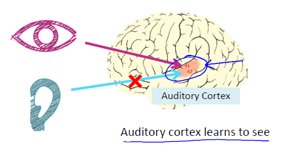
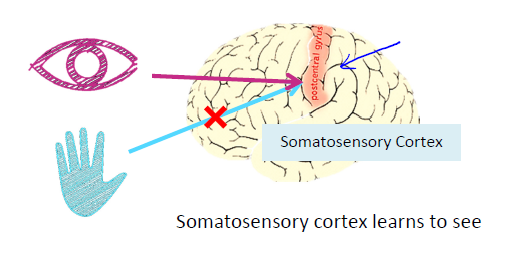
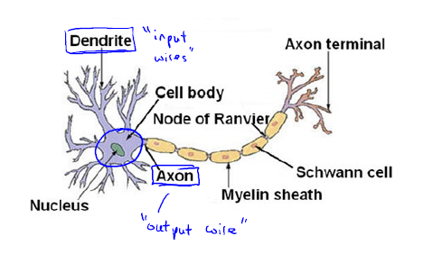
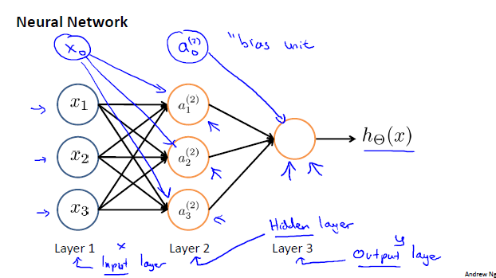
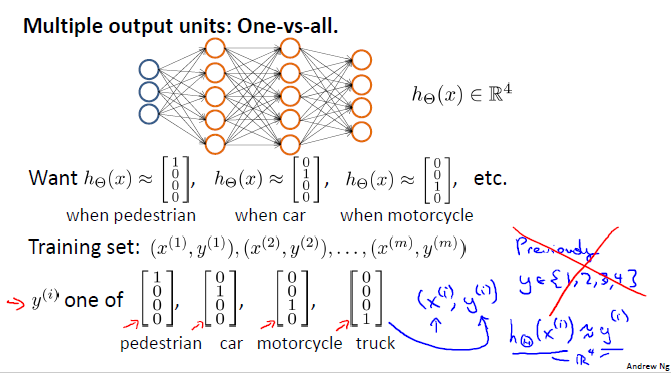
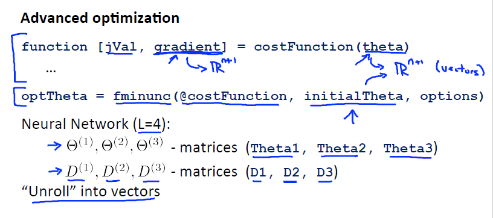
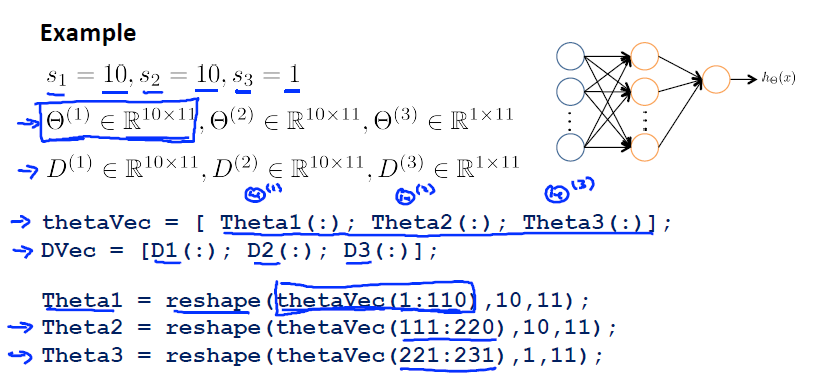
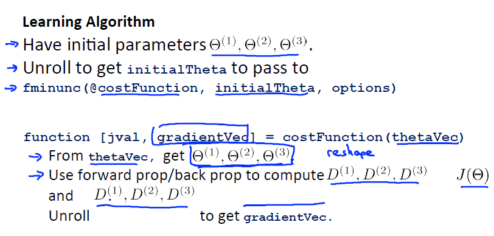

.. _neural-networks-label:

Neural Networks
===============
	* Origins: Algorithms that try to mimic the brain
	* Was very widely used in 80s and early 90s; popularity diminished in late 90s
	* Recent resurgence: State-of-the-art technique for many applications

Neural Networks: Representation
-------------------------------
	* Non-linear Hypotheses
	* Non-linear Classification
	* Computer Vision: Car detection

Neurons and the Brain
^^^^^^^^^^^^^^^^^^^^^
	The "one learning algorithm" hypothesis

+---------+---------+
|  |nn1|  |  |nn2|  |
+---------+---------+

Model Representation I
----------------------

Neuron and the Brain
^^^^^^^^^^^^^^^^^^^^

Neuron Model: Logistic Unit
^^^^^^^^^^^^^^^^^^^^^^^^^^^

.. image:: ../_images/nn_input_output.png
	:align: center

Let's define:
	* :math:`a^{(j)}_{i}` = "activation" of unit :math:`i` in layer :math:`j`
	* :math:`\Theta^{(j)}` = matrix of weights controlling function mapping from layer :math:`j` to layer :math:`j + 1`

Here:
	* Input layer :math:`1` has :math:`3` units: :math:`x_{1}, x_{2}, x_{3}`; :math:`\Theta^{(1)} \in \mathbb {R^{3*4}}` 
	* Hidden layer :math:`2` has :math:`3` units: :math:`a^{(2)}_{1}, a^{(2)}_{2}, a^{(2)}_{3}`; :math:`\Theta^{(2)} \in \mathbb {R^{4}}` 
	* Output layer :math:`3` has :math:`1` unit: :math:`a^{(3)}_{1} = y = h_{\Theta}(x)`

Add "bias unit", :math:`x_{0} = 1`, compute for Hidden layer :math:`2`:
	* :math:`a^{(2)}_{1} = g(\Theta^{(1)}_{10} x_{0} + \Theta^{(1)}_{11} x_{1} + \Theta^{(1)}_{12} x_{2} + \Theta^{(1)}_{13} x_{3})` 
	* :math:`a^{(2)}_{2} = g(\Theta^{(1)}_{20} x_{0} + \Theta^{(1)}_{21} x_{1} + \Theta^{(1)}_{22} x_{2} + \Theta^{(1)}_{23} x_{3})` 
	* :math:`a^{(2)}_{3} = g(\Theta^{(1)}_{30} x_{0} + \Theta^{(1)}_{31} x_{1} + \Theta^{(1)}_{32} x_{2} + \Theta^{(1)}_{33} x_{3})` 

Add "bias unit", :math:`a^{(2)}_{0} = 1`, compute for Output layer :math:`3`:
	* :math:`h_{\Theta}(x) = a^{(3)}_{1} = g(\Theta^{(2)}_{10} a^{(2)}_{0} + \Theta^{(2)}_{11} a^{(2)}_{1} + \Theta^{(2)}_{12} a^{(2)}_{2} + \Theta^{(2)}_{13} a^{(2)}_{3})` 

If network has :math:`s_{j}` units in layer :math:`j`, :math:`s_{j+1}` units in layer :math:`j+1`, then :math:`\Theta^{(j)}` 
will be of dimension :math:`s_{j+1}*(s_{j}+1)`. :math:`\Theta^{(j)} \in \mathbb {R^{s_{j+1}*(s_{j}+1)}}`

Model Representation II
-----------------------

Forward Propagation: Vectorized Implementation
^^^^^^^^^^^^^^^^^^^^^^^^^^^^^^^^^^^^^^^^^^^^^^
	* :math:`a^{(1)} = x = {\begin{bmatrix}x_{0}\\x_{1}\\x_{2}\\x_{3}\end{bmatrix}}`
	* :math:`z^{(2)} = {\begin{bmatrix}z^{(2)}_{1}\\z^{(2)}_{2}\\z^{(2)}_{3}\end{bmatrix}} = \Theta^{(1)} a^{(1)}`
	* :math:`a^{(2)} = g(z^{(2)}) \in \mathbb {R^{3}}`, add :math:`a^{(2)}_{0} = 1`, :math:`a^{(2)} \in \mathbb {R^{4}}`
	* :math:`z^{(3)} = \Theta^{(2)} a^{(2)}`
	* :math:`h_{\Theta}(x) = a^{(3)}_{1} = g(z^{(3)})`

* Neural Network learning its own features
* Other network architectures can have many hidden layers between the input layer and the output layer

.. image:: ../_images/nn_multiple_hidden_layers.png
	:align: center

Multi-class Classification
^^^^^^^^^^^^^^^^^^^^^^^^^^
	Multiple output units: One-vs-all

	
Neural Network (Classification)
-------------------------------
	* Training set, :math:`m` examples: :math:`{ (x^{(1)}, y^{(1)}), (x^{(2)}, y^{(2)}), ..., (x^{(m)}, y^{(m)}) }`
	* :math:`L` = total no. of layers in network
	* :math:`s_{l}` = no. of units (not counting bias unit) in layer :math:`l`

	Binary Classification:
		* :math:`y^{(i)} = 0` or :math:`1 \in \mathbb {R}`
		* :math:`1` output unit

	Multi-class Classification (K classes):
		* :math:`y^{(i)} \in \mathbb {R^{K}}` E.g. :math:`{\begin{bmatrix}1\\0\\0\\0\end{bmatrix}}`, :math:`{\begin{bmatrix}0\\1\\0\\0\end{bmatrix}}`, :math:`{\begin{bmatrix}0\\0\\1\\0\end{bmatrix}}`, :math:`{\begin{bmatrix}0\\0\\0\\1\end{bmatrix}}`
		* Representing pedestrian, car, motorcycle, and truck respectively
		* :math:`K` output units

Cost Function
-------------
	Logistic Regression:

	:math:`J(\theta) = - \frac{1}{m} [ \sum_{i=1}^{m} y^{(i)} \log h_\theta (x^{(i)}) + (1 - y^{(i)}) \log(1 - h_\theta (x^{(i)})) ] + 
	\frac{\lambda}{2m} \sum_{j=1}^{n} \theta_{j}^2`

		* Exclude :math:`\theta_{0}` for regularization

	Neural Network:
		* :math:`h_\Theta (x) \in \mathbb {R^{K}}` and :math:`(h_\Theta (x))_{k} = k^{th}` output

	:math:`J(\Theta) = - \frac{1}{m} [ \sum_{i=1}^{m} \sum_{k=1}^{K} y^{(i)}_{k} \log(h_\Theta (x^{(i)}))_{k} + (1 - y^{(i)}_{k}) \log(1 - (h_\Theta (x^{(i)}))_{k}) ] + 
	\frac{\lambda}{2m} \sum_{l=1}^{L-1} \sum_{i=1}^{s_{l}} \sum_{j=1}^{s_{l+1}} (\Theta_{ji}^{(l)})^2`

Backpropagation Algorithm
-------------------------
	Gradient Computation
		* Cost function :math:`J(\Theta)`
		* :math:`\min_{\Theta} J(\Theta)`

	Need code to compute:
		* :math:`J(\Theta)`
		* :math:`\frac{\partial }{\partial \Theta_{ji}^{(l)}} J(\Theta)`, :math:`\Theta_{ji}^{(l)} \in \mathbb {R}`

	Given one training example (:math:`x, y`):
	
	Forward Propagation:
		* :math:`a^{(1)} = x`
		* :math:`z^{(2)} = \Theta^{(1)} a^{(1)}`
		* :math:`a^{(2)} = g(z^{(2)})`, (add :math:`a_{0}^{(2)} = 1`)
		* :math:`z^{(3)} = \Theta^{(2)} a^{(2)}`
		* :math:`a^{(3)} = g(z^{(3)})`, (add :math:`a_{0}^{(3)} = 1`)
		* :math:`z^{(4)} = \Theta^{(3)} a^{(3)}`
		* :math:`a^{(4)} = h_\Theta (x) = g(z^{(4)})`

	Gradient computation: Backpropagation algorithm:

	Intuition: :math:`\delta_{j}^{(l)}` = "error" of node :math:`j` in layer :math:`l`

	For each output unit (layer :math:`L = 4`)
		* :math:`\delta_{j}^{(4)} = a_{j}^{(4)} - y_{j}`, :math:`a_{j}^{(4)} = (h_\theta (x))_{j}`
	Or
		* :math:`\delta^{(4)} = a^{(4)} - y`
		* :math:`\delta^{(3)} = (\Theta^{(3)})^{T} \delta^{(4)} .* g'(z^{(3)})`
		* :math:`\delta^{(2)} = (\Theta^{(2)})^{T} \delta^{(3)} .* g'(z^{(2)})`
		* No :math:`\delta^{(1)}`

	* :math:`\frac{\partial }{\partial \Theta_{ji}^{(l)}} J(\Theta) = a_{j}^{(l)} \delta_{i}^{(l+1)}` (ignore :math:`\lambda` for now, set :math:`\lambda = 0`)

	Backpropagation Algorithm:
		* Training set :math:`{ (x^{(1)}, y^{(1)}), ..., (x^{(m)}, y^{(m)}) }`
		* Set :math:`\Delta^{(l)}_{ij} = 0` (for all :math:`l, i, j`); (used to update :math:`\frac{\partial }{\partial \Theta_{ji}^{(l)}} J(\Theta)`)
		* For :math:`i = 1` to :math:`m` <- :math:`(x^{(i)}, y^{(i)})`
			* Set :math:`a^{(1)} = x^{(i)}`
			* Perform forward propagation to compute :math:`a^{(1)}` (for all :math:`l = 2, 3, ..., L`)
			* Using :math:`y^{(i)}`, compute :math:`\delta^{(L)} = a^{(L)} - y^{(i)}`
			* Perform backward propagation to compute :math:`\delta^{(L-1)}, \delta^{(L-2)}, ..., \delta^{(2)}`
			* :math:`\Delta^{(l)}_{ij} = \Delta^{(l)}_{ij} + a_{j}^{(l)} \delta_{i}^{(l+1)}`
			* Or :math:`\Delta^{(l)} = \Delta^{(l)} + \delta^{(l+1)} (a^{(l)})^{T}`
		* :math:`D^{(l)}_{ij} = \frac{1}{m} \Delta^{(l)}_{ij}`; (for :math:`j = 0`)
		* :math:`D^{(l)}_{ij} = \frac{1}{m} \Delta^{(l)}_{ij} + \lambda \Theta_{ij}^{(l)}`; (for :math:`j \neq 0`)
		* :math:`\frac{\partial }{\partial \Theta_{ji}^{(l)}} J(\Theta) = D^{(l)}_{ij}`

Backpropagation Intuition
-------------------------
	* What is backpropagation doing?
		:math:`J(\Theta) = - \frac{1}{m} [ \sum_{i=1}^{m} y^{(i)} \log(h_\Theta (x^{(i)})) + (1 - y^{(i)}) \log(1 - (h_\Theta (x^{(i)}))) ] + 
		\frac{\lambda}{2m} \sum_{l=1}^{L-1} \sum_{i=1}^{s_{l}} \sum_{j=1}^{s_{l+1}} (\Theta_{ji}^{(l)})^2`

	* Focusing on a single example :math:`x^{(i)}, y^{(i)}`, the case of :math:`1` output unit, and ignoring regularization (:math:`\lambda = 0`):
		:math:`cost(i) = y^{(i)} \log(h_\Theta (x^{(i)})) + (1 - y^{(i)}) \log(1 - h_\Theta (x^{(i)}))`
	* (Think of :math:`cost(i)` ~ :math:`(h_\Theta (x^{(i)}) - y^{(i)})^2`)
	* I.e. how well is the network doing on example :math:`i`?
	* :math:`\delta_{j}^{(l)}` = "error" of cost for :math:`a_{j}^{(l)}` (unit :math:`j` in layer :math:`l`)
	* Formally, :math:`\delta_{j}^{(l)} = \frac{\partial }{\partial z_{j}^{(l)}} cost(i)` (for :math:`j \geq 0`), where
		:math:`cost(i) = y^{(i)} \log(h_\Theta (x^{(i)})) + (1 - y^{(i)}) \log(1 - h_\Theta (x^{(i)}))`

Implementation Note: Unrolling Parameters:
------------------------------------------

Gradient Checking
-----------------

TODO: week 5

Gradient Descent
----------------
	Also called Batch Gradient Descent for it's processing all training examples in one batch at every iteration. 

	:math:`\theta_{j} = \theta_{j} - \alpha \frac{\partial }{\partial \theta_{j}} J(\Theta)`

	Repeat for each iteration {

		:math:`\theta_{j} = \theta_{j} - \alpha \frac{1}{m} \sum_{i=1}^{m} (h_\theta (x^{(i)}) - y^{(i)}) x^{(i)}_{j}`

		Here :math:`x^{(i)}_{0} = 1`, :math:`j = 0, ..., n`

	}

	:math:`\alpha` = :ref:`learning-rate-label`.

