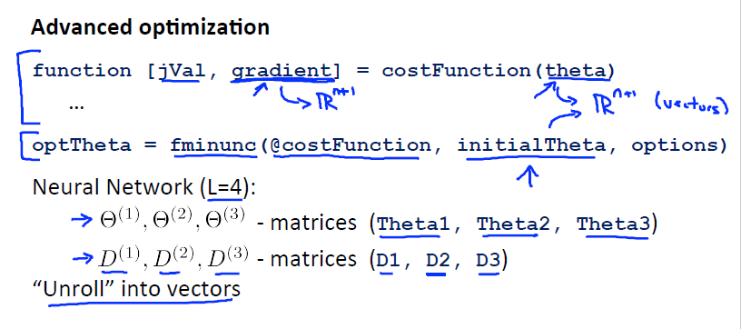
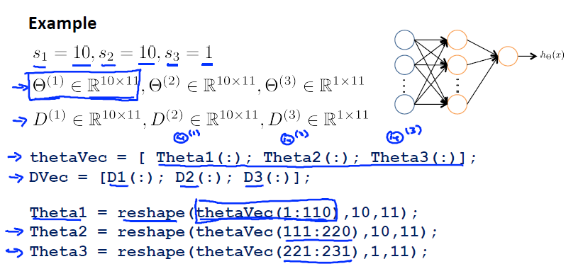

Neural Network (Classification)
===============================

	* Training set, :math:`m` examples: :math:`{ (x^{(1)}, y^{(1)}), (x^{(2)}, y^{(2)}), ..., (x^{(m)}, y^{(m)}) }`
	* :math:`L` = total no. of layers in network
	* :math:`s_{l}` = no. of units (not counting bias unit) in layer :math:`l`

	Binary Classification:
		* :math:`y^{(i)} = 0` or :math:`1 \in \mathbb {R}`
		* :math:`1` output unit

	Multi-class Classification (K classes):
		* :math:`y^{(i)} \in \mathbb {R^{K}}` E.g. :math:`{\begin{bmatrix}1\\0\\0\\0\end{bmatrix}}`, :math:`{\begin{bmatrix}0\\1\\0\\0\end{bmatrix}}`, :math:`{\begin{bmatrix}0\\0\\1\\0\end{bmatrix}}`, :math:`{\begin{bmatrix}0\\0\\0\\1\end{bmatrix}}`
		* Representing pedestrian, car, motorcycle, and truck respectively
		* :math:`K` output units

Cost Function
-------------
	Logistic Regression:

	:math:`J(\theta) = - \frac{1}{m} [ \sum_{i=1}^{m} y^{(i)} \log h_\theta (x^{(i)}) + (1 - y^{(i)}) \log(1 - h_\theta (x^{(i)})) ] + 
	\frac{\lambda}{2m} \sum_{j=1}^{n} \theta_{j}^2`

		* Exclude :math:`\theta_{0}` for regularization

	Neural Network:
		* :math:`h_\Theta (x) \in \mathbb {R^{K}}` and :math:`(h_\Theta (x))_{k} = k^{th}` output

	:math:`J(\Theta) = - \frac{1}{m} [ \sum_{i=1}^{m} \sum_{k=1}^{K} y^{(i)}_{k} \log(h_\Theta (x^{(i)}))_{k} + (1 - y^{(i)}_{k}) \log(1 - (h_\Theta (x^{(i)}))_{k}) ] + 
	\frac{\lambda}{2m} \sum_{l=1}^{L-1} \sum_{i=1}^{s_{l}} \sum_{j=1}^{s_{l+1}} (\Theta_{ji}^{(l)})^2`

Backpropagation Algorithm
-------------------------
	Gradient Computation
		* Cost function :math:`J(\Theta)`
		* :math:`\min_{\Theta} J(\Theta)`

	Need code to compute:
		* :math:`J(\Theta)`
		* :math:`\frac{\partial }{\partial \Theta_{ji}^{(l)}} J(\Theta)`, :math:`\Theta_{ji}^{(l)} \in \mathbb {R}`

	Given one training example (:math:`x, y`):
	
	Forward Propagation:
		* :math:`a^{(1)} = x`
		* :math:`z^{(2)} = \Theta^{(1)} a^{(1)}`
		* :math:`a^{(2)} = g(z^{(2)})`, (add :math:`a_{0}^{(2)} = 1`)
		* :math:`z^{(3)} = \Theta^{(2)} a^{(2)}`
		* :math:`a^{(3)} = g(z^{(3)})`, (add :math:`a_{0}^{(3)} = 1`)
		* :math:`z^{(4)} = \Theta^{(3)} a^{(3)}`
		* :math:`a^{(4)} = h_\Theta (x) = g(z^{(4)})`

	Gradient computation: Backpropagation algorithm:

	Intuition: :math:`\delta_{j}^{(l)}` = "error" of node :math:`j` in layer :math:`l`

	For each output unit (layer :math:`L = 4`)
		* :math:`\delta_{j}^{(4)} = a_{j}^{(4)} - y_{j}`, :math:`a_{j}^{(4)} = (h_\theta (x))_{j}`
	Or
		* :math:`\delta^{(4)} = a^{(4)} - y`
		* :math:`\delta^{(3)} = (\Theta^{(3)})^{T} \delta^{(4)} .* g'(z^{(3)})`
		* :math:`\delta^{(2)} = (\Theta^{(2)})^{T} \delta^{(3)} .* g'(z^{(2)})`
		* No :math:`\delta^{(1)}`

	* :math:`\frac{\partial }{\partial \Theta_{ji}^{(l)}} J(\Theta) = a_{j}^{(l)} \delta_{i}^{(l+1)}` (ignore :math:`\lambda` for now, set :math:`\lambda = 0`)

	Backpropagation Algorithm:
		* Training set :math:`{ (x^{(1)}, y^{(1)}), ..., (x^{(m)}, y^{(m)}) }`
		* Set :math:`\Delta^{(l)}_{ij} = 0` (for all :math:`l, i, j`); (used to update :math:`\frac{\partial }{\partial \Theta_{ji}^{(l)}} J(\Theta)`)
		* For :math:`i = 1` to :math:`m` <- :math:`(x^{(i)}, y^{(i)})`
			* Set :math:`a^{(1)} = x^{(i)}`
			* Perform forward propagation to compute :math:`a^{(1)}` (for all :math:`l = 2, 3, ..., L`)
			* Using :math:`y^{(i)}`, compute :math:`\delta^{(L)} = a^{(L)} - y^{(i)}`
			* Perform backward propagation to compute :math:`\delta^{(L-1)}, \delta^{(L-2)}, ..., \delta^{(2)}`
			* :math:`\Delta^{(l)}_{ij} = \Delta^{(l)}_{ij} + a_{j}^{(l)} \delta_{i}^{(l+1)}`
			* Or :math:`\Delta^{(l)} = \Delta^{(l)} + \delta^{(l+1)} (a^{(l)})^{T}`
		* :math:`D^{(l)}_{ij} = \frac{1}{m} \Delta^{(l)}_{ij}`; (for :math:`j = 0`)
		* :math:`D^{(l)}_{ij} = \frac{1}{m} \Delta^{(l)}_{ij} + \lambda \Theta_{ij}^{(l)}`; (for :math:`j \neq 0`)
		* :math:`\frac{\partial }{\partial \Theta_{ji}^{(l)}} J(\Theta) = D^{(l)}_{ij}`

Backpropagation Intuition
-------------------------
	* What is backpropagation doing?
		:math:`J(\Theta) = - \frac{1}{m} [ \sum_{i=1}^{m} y^{(i)} \log(h_\Theta (x^{(i)})) + (1 - y^{(i)}) \log(1 - (h_\Theta (x^{(i)}))) ] + 
		\frac{\lambda}{2m} \sum_{l=1}^{L-1} \sum_{i=1}^{s_{l}} \sum_{j=1}^{s_{l+1}} (\Theta_{ji}^{(l)})^2`

	* Focusing on a single example :math:`x^{(i)}, y^{(i)}`, the case of :math:`1` output unit, and ignoring regularization (:math:`\lambda = 0`):
		:math:`cost(i) = y^{(i)} \log(h_\Theta (x^{(i)})) + (1 - y^{(i)}) \log(1 - h_\Theta (x^{(i)}))`
	* (Think of :math:`cost(i)` ~ :math:`(h_\Theta (x^{(i)}) - y^{(i)})^2`)
	* I.e. how well is the network doing on example :math:`i`?
	* :math:`\delta_{j}^{(l)}` = "error" of cost for :math:`a_{j}^{(l)}` (unit :math:`j` in layer :math:`l`)
	* Formally, :math:`\delta_{j}^{(l)} = \frac{\partial }{\partial z_{j}^{(l)}} cost(i)` (for :math:`j \geq 0`), where
		:math:`cost(i) = y^{(i)} \log(h_\Theta (x^{(i)})) + (1 - y^{(i)}) \log(1 - h_\Theta (x^{(i)}))`

Implementation Note: Unrolling Parameters:
------------------------------------------

.. image:: ../_images/unroll_into_vectors3.png
	:scale: 70%
	:align: center

Gradient Checking
-----------------

Numerical Estimation of Gradients
^^^^^^^^^^^^^^^^^^^^^^^^^^^^^^^^^
	Implement: :math:`\frac{\partial }{\partial \theta} J(\theta) \approx gradApprox = \frac{J(\theta + \epsilon) - J(\theta - \epsilon)}{2\epsilon}`, :math:`\theta \in \mathbb {R}, \epsilon = 10^{-4}`

	Parameter vector :math:`\theta`:
		* :math:`\theta = \theta_{1}, \theta_{2}, ..., \theta_{n}; \theta \in \mathbb {R^{n}}` (E.g. :math:`\theta` is "unrolled" version of :math:`\Theta^{(1)}, \Theta^{(2)}, \Theta^{(3)}`)
		* :math:`\frac{\partial }{\partial \theta_{1}} J(\theta) = \frac{J(\theta_{1} + \epsilon, \theta_{2}, ..., \theta_{n}) - J(\theta_{1} - \epsilon, \theta_{2}, ..., \theta_{n})}{2\epsilon}`
		* :math:`\frac{\partial }{\partial \theta_{2}} J(\theta) = \frac{J(\theta_{1}, \theta_{2} + \epsilon, ..., \theta_{n}) - J(\theta_{1}, \theta_{2} - \epsilon, ..., \theta_{n})}{2\epsilon}`
		* ---
		* :math:`\frac{\partial }{\partial \theta_{n}} J(\theta) = \frac{J(\theta_{1}, \theta_{2}, ..., \theta_{n} + \epsilon) - J(\theta_{1}, \theta_{2}, ..., \theta_{n} - \epsilon)}{2\epsilon}`

Octave Code
^^^^^^^^^^^

.. code-block:: octave 

	for i = 1:n,
		thetaPlus = theta;
		thetaPlus(i) += EPSILON;
		thetaMinus = theta;
		thetaMinus(i) -= EPSILON;
		gradApprox(i) = (J(thetaPlus) - J(thetaMinus))/(2*EPSILON);
	end;

Checking
^^^^^^^^
	Check that :math:`gradApprox \approx DVec` (from backprop)

Implementation Note:
^^^^^^^^^^^^^^^^^^^^
	* Implement backprop to compute DVec (unrolled :math:`D^{(1)}, D^{(2)}, D^{(3)}`)
	* Implement numerical gradient check to compute gradApprox
	* Make sure they give similar values
	* Turn off gradient checking. Using backprop code for learning.

Important:
^^^^^^^^^^
	* Be sure to disable your gradient checking code before training your classifier. If you run numerical 
	  gradient computation on every iteration of gradient descent (or in the inner loop of costFunction(…)) 
	  your code will be very slow. 

:ref:`random-initialization-label`
----------------------------------

Putting It Together
-------------------
TODO: week 5

	Symbols used in LaTeX markup.

	* :math:`\approx`, :math:`\not \approx`, :math:`\simeq`, :math:`\sim`, :math:`\cong` is congruence (一致)

